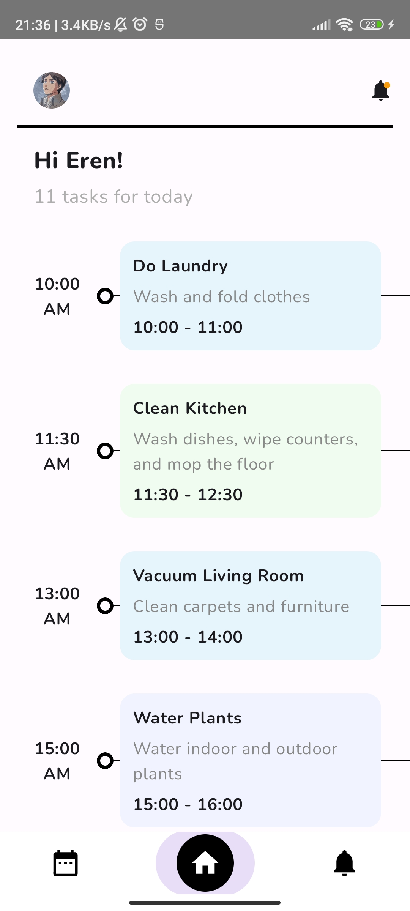
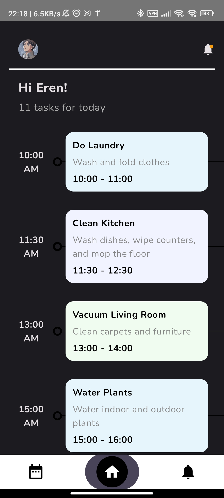

# Preview

  
  

   

---

# ToDo App

This is a simple Todo app built with Kotlin and Jetpack Compose.

## Features

- Add new tasks
- Mark tasks as completed
- Delete tasks
- View completed tasks

## Requirements

- Android Studio Flamingo (2022.2.1) or later
- Android device running Android 7.0 (Nougat) or later

## Installation

1. Clone the repository to your local machine
2. Open the project in Android Studio
3. Connect your Android device to your computer and select "Run" from the toolbar

## Usage

- Add a new task by entering text in the input field and pressing "Add"
- Mark a task as completed by tapping on the checkbox next to it
- Delete a task by swiping it to the left or right
- View completed tasks by selecting the "Completed" tab at the top of the screen

## Contributing

Contributions are always welcome! If you'd like to contribute to the project, please open an issue or submit a pull request.

## Credits

This app was created by [Me](wwww.github.com/DashingAdi). Thanks to the following resources for their contributions:

- [Jetpack Compose documentation](https://developer.android.com/jetpack/compose)
- [Android Kotlin Fundamentals codelabs](https://developer.android.com/courses/kotlin-android-fundamentals/overview)

## License

This project is licensed under the MIT License - see the [LICENSE](LICENSE) file for details.
